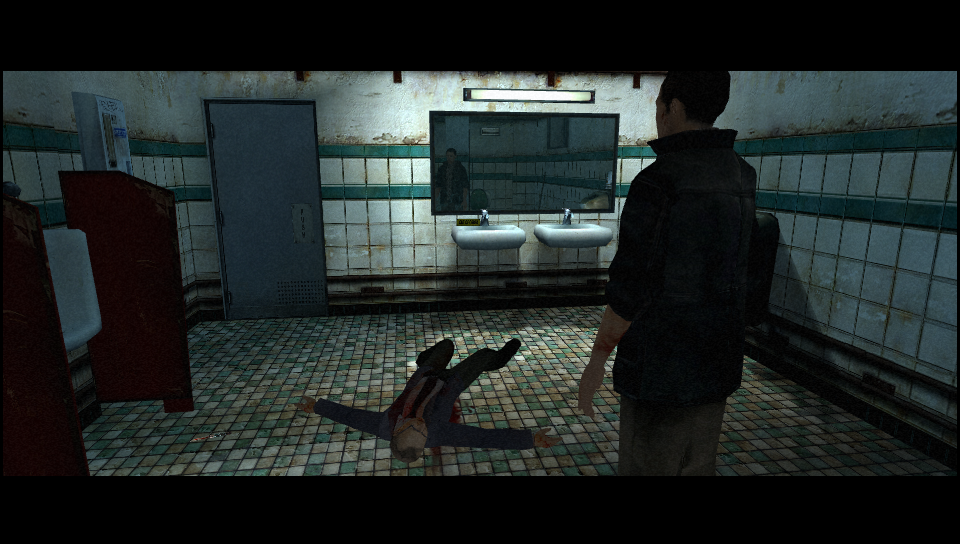

# Fahrenheit Vita

<p align="center"></p>

This is a wrapper/port of <b>Fahrenheit: Indigo Prophecy</b> for the *PS Vita*.

The port works by loading the official Android ARMv7 executables in memory, resolving its imports with native functions and patching it in order to properly run.
By doing so, it's basically as if we emulate a minimalist Android environment in which we run natively the executable as is.

## Changelog

### v0.8

- Initial release.

## Known Issues

- The game can stutter from time to time due to assets loading.
- Framerate is inconsistent and in certain scenarios it can get pretty low.
- Some very specific scenes are way darker than usual due to sRGB colorspace being used instead of Linear one (eg: Lucas monologue in the initial cutscene).
- Game may crash due to out of memory from time to time but the game autosaves at scenes end thus not being a problem at all.
- Some interactions prompt don't come out soon but require some loading (Probably caused by slow Vita I/O).

## Setup Instructions (For End Users)

In order to properly install the game, you'll have to follow these steps precisely:

- Install [kubridge](https://github.com/TheOfficialFloW/kubridge/releases/) and [FdFix](https://github.com/TheOfficialFloW/FdFix/releases/) by copying `kubridge.skprx` and `fd_fix.skprx` to your taiHEN plugins folder (usually `ux0:tai`) and adding two entries to your `config.txt` under `*KERNEL`:
  
```
  *KERNEL
  ux0:tai/kubridge.skprx
  ux0:tai/fd_fix.skprx
```

**Note** Don't install fd_fix.skprx if you're using rePatch plugin

- **Optional**: Install [PSVshell](https://github.com/Electry/PSVshell/releases) to overclock your device to 500Mhz.
- Install `libshacccg.suprx`, if you don't have it already, by following [this guide](https://samilops2.gitbook.io/vita-troubleshooting-guide/shader-compiler/extract-libshacccg.suprx).
- Obtain your copy of *Fahrenheit: Indigo Prophecy* legally for Android in form of an `.apk` file and two `.obb` files. [You can get all the required files directly from your phone](https://stackoverflow.com/questions/11012976/how-do-i-get-the-apk-of-an-installed-app-without-root-access) or by using an apk extractor you can find in the play store.
- Open the apk with your zip explorer and extract the files `libFahrenheit.so`,`libc++_shared.so` and `libiconv.so` from the `lib/armeabi-v7a` folder to `ux0:data/fahrenheit`.
- Download `unobb.zip` from the Release section of this repository.
- Extract `unobb.zip` in a folder in your PC and place the two `.obb` files in the same folder where you'll have `unobb.exe`.
- Run with a command-line window `unobb.exe main.16.com.aspyr.fahrenheit.obb data` first and `unobb.exe patch.16.com.aspyr.fahrenheit.obb data` second.
- Install [Total Commander](https://www.ghisler.com/download.htm) and its [PSARC plugin](http://totalcmd.net/plugring/PSARC.html).
- Backup the three `.txt` files inside `data/textures` and then remove them.
- Launch Total Commander and navigate up to `data` folder.
- Right click on `textures` folder; it will turn red.
- Click on File -> Pack.
- Set `psarc` as Compressor and then click on `Configure` button right below.
- Set `PSARC Version` to `1.3`, `Compression` to `ZLIB` and `Ratio` to `0` and press `OK`
- Press `OK` to launch the compression, it will create a file in `C:\textures.psarc`. (If you get an error, manually change the location in the command line string `psarc: DESTINATIONFOLDER\textures.psarc`).
- Remove the whole `textures` folder from `data` folder.
- Transfer the content inside `data` folder to `ux0:data/fahrenheit`.
- Transfer `textures.psarc` to `ux0:data/fahrenheit`.
- Extract `datafiles.zip` available in the Release page of this repository to `ux0:data`.
- Place the three `.txt` files you backed up before inside `ux0:data/fahrenheit/textures` (Create the folder if you don't have it).

## Build Instructions (For Developers)

In order to build the loader, you'll need a [vitasdk](https://github.com/vitasdk) build fully compiled with softfp usage.  
You can find a precompiled version here: https://github.com/vitasdk/buildscripts/actions/runs/1102643776.  
Additionally, you'll need these libraries to be compiled as well with `-mfloat-abi=softfp` added to their CFLAGS:

- [SDL2_vitagl](https://github.com/Northfear/SDL/tree/vitagl)

- [libmathneon](https://github.com/Rinnegatamante/math-neon)

  - ```bash
    make install
    ```

- [vitaShaRK](https://github.com/Rinnegatamante/vitaShaRK)

  - ```bash
    make install
    ```

- [kubridge](https://github.com/TheOfficialFloW/kubridge)

  - ```bash
    mkdir build && cd build
    cmake .. && make install
    ```

- [vitaGL](https://github.com/Rinnegatamante/vitaGL)

  - ````bash
    make SOFTFP_ABI=1 HAVE_CUSTOM_HEAP=1 NO_DEBUG=1 install
    ````

After all these requirements are met, you can compile the loader with the following commands:

```bash
mkdir build && cd build
cmake .. && make
```

## Credits

- TheFloW for the original .so loader, the unobb application and for improvements to the port.
- CatoTheYounger for extensively testing the homebrew.
- Brandonheat8 for the Livearea assets.
- Northfear for the SDL2 fork with vitaGL as backend.
